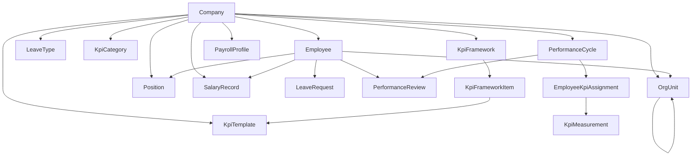

# Hr-Mastered: Full Project Blueprint, System Architecture, and Technical Reference

This document serves as the master architectural reference for **Hr-Mastered**, documenting the complete data model, multi-tenant security architecture, business domain workflows, and technical implementation across all 9 build phases.

---

## 1. Executive Summary & Product Scope

**Hr-Mastered** is an enterprise multi-tenant workforce operations, payroll, performance, and compliance platform built with Django 5.x REST Framework and React + Vite.

### Core Domain Capabilities:
1. **Organizational Structure & Tenant Isolation**: Company-scoped departments, hierarchical organizational units (`OrgUnit`), positions, and role-based access control (`HR_ADMIN`, `MANAGER`, `HOD`, `FINANCE`, `EMPLOYEE`).
2. **Leave Management & 2-Stage Approval Routing**: Multi-tier approval routing (`Stage 1: Department Head` $\rightarrow$ `Stage 2: HR Admin`), company-scoped delegation, write-once immutable decision audit trails, and concurrency row locking.
3. **KPI Framework & Dynamic Inheritance Engine**: Hierarchical KPI resolution (`GLOBAL` $\rightarrow$ `DEPARTMENT` $\rightarrow$ `POSITION`), framework items with weights and targets, and employee-level overrides (`ADD`, `MODIFY`, `REMOVE`).
4. **Mathematical KPI Scoring Engine**: Strict mathematical scoring for all measurement types (`HIGHER_IS_BETTER`, `LOWER_IS_BETTER`, `TARGET_BASED`, `BOOLEAN`, `RATING`), boundary normalization clamping ($[\text{min\_score}, \text{max\_score}]$), and weighted contribution calculations.
5. **Performance Review & Calibration State Machine**: 6-stage lifecycle (`DRAFT` $\rightarrow$ `SUBMITTED` $\rightarrow$ `MANAGER_REVIEWED` $\rightarrow$ `HR_REVIEWED` $\rightarrow$ `CALIBRATED` $\rightarrow$ `FINALIZED`), multi-tier ratings, HR calibration curves, and strict immutability enforcement upon finalization.
6. **Salary History & Component-Based Compensation**: Comprehensive compensation structure (`base_salary`, `housing_allowance`, `transport_allowance`, `meal_allowance`, `other_allowances`, computed `gross_salary`), effective-date history tracking, overlap prevention validation, and atomic supersede workflow.
7. **Payroll Pipeline & Deductions**: Automated calculations, statutory rules, bonus/advance adjustments, hold states, dispute resolution flow, and multi-format settlement exports (CSV, XLSX, PDF).
8. **Delivery Worker & Secure Storage**: Zoho WorkDrive / Mail integration via an idempotent background worker daemon with exponential backoff and Fernet AES-256 field encryption for sensitive data.

> [!NOTE]
> All legacy loan management, credit scoring, and lending workflows have been archived into `archive/loans/` and are fully excluded from active runtime paths.

---

## 2. Domain Models & Architecture



### 2.1 Organizational Hierarchy & Multi-Tenancy
- **`Company`**: Primary tenant boundary. Every entity inherits from `CompanyScopedModel` or `PayrollScopedModel`.
- **`OrgUnit`**: Hierarchical units (Divisions, Departments, Units) with recursive parent linkage and designated `head` (`Employee`).
- **`Position`**: Job titles with department assignments and organogram linkages.
- **`Employee`**: Custom user model with role-based permissions (`HR_ADMIN`, `MANAGER`, `HOD`, `FINANCE`, `EMPLOYEE`), manager hierarchy, and superuser-only `is_org_admin` governance flag.

### 2.2 Leave Management & Approvals
- **`LeaveRequest`**: Multi-stage state machine (`PENDING_DEPARTMENT_HEAD` $\rightarrow$ `PENDING_HR` $\rightarrow$ `APPROVED` / `REJECTED`).
- **`ApprovalDecision`**: Write-once immutable decision records storing actor, stage, decision (`APPROVED`, `REJECTED`), reason, and timestamp.
- **`ApprovalDelegation`**: Temporary delegation of approval authority restricted to within the same company tenant.

### 2.3 KPI Engine & Scoring Service
- **`KpiTemplate`**: Metric definitions with `measurement_type`, `direction` (`HIGHER_IS_BETTER`, `LOWER_IS_BETTER`, `TARGET_BASED`, `BOOLEAN`, `RATING`), `min_score`, `max_score`, `default_target`, and `default_weight`.
- **`KpiFramework`**: Framework scoped to `GLOBAL`, `DEPARTMENT`, or `POSITION`.
- **`KpiFrameworkItem`**: Connects framework to templates with specific weights and targets ($\sum \text{weight} = 100$).
- **`EmployeeKpiOverride`**: Explicit modifications (`ADD`, `MODIFY`, `REMOVE`) per employee.
- **`KpiScoringService`**:
  - Higher is better: $\text{Raw Score} = (\text{Actual} / \text{Target}) \times 100$
  - Lower is better: $\text{Raw Score} = (\text{Target} / \text{Actual}) \times 100$
  - Target based: $\text{Raw Score} = \max(0, 100 - (\text{Deviation} / \text{Target}) \times 100)$
  - Weighted Contribution: $\text{Contribution} = \text{Normalized Score} \times (\text{Weight} / 100)$

### 2.4 Performance Review & Calibration
- **`PerformanceReview`**:
  - Lifecycle: `DRAFT` $\rightarrow$ `SUBMITTED` $\rightarrow$ `MANAGER_REVIEWED` $\rightarrow$ `HR_REVIEWED` $\rightarrow$ `CALIBRATED` $\rightarrow$ `FINALIZED`.
  - Captures `system_score` (from scoring engine), `employee_self_score`, `manager_score`, `hr_score`, `calibrated_score`, and `final_score`.
  - Immutability: Modifications or deletions after reaching `FINALIZED` status are blocked at model level.

### 2.5 Salary Records & Compensation
- **`SalaryRecord`**:
  - Components: `base_salary`, `housing_allowance`, `transport_allowance`, `meal_allowance`, `other_allowances`.
  - Computed `gross_salary` property.
  - Date ranges with overlap validation preventing intersecting `ACTIVE` records for the same employee.
  - Atomic `/supersede/` endpoint to close previous record and open new compensation package.

---

## 3. Security & Access Control

| Role | Permissions |
|---|---|
| **Superuser** | Unrestricted global access; can grant/revoke `is_org_admin`. |
| **Org Admin** (`is_org_admin=True`) | Organogram and reporting line restructuring. |
| **HR Admin** | Full employee lifecycle, KPI templates/frameworks, Performance Cycle review calibration/finalization, Salary records management, Stage 2 leave approvals. |
| **Finance** | Payroll profiles, payroll runs, settlement exports, bank reconciliations, deduction dispute resolutions. |
| **Manager / HOD** | Stage 1 leave approvals for direct reports/department, team KPI assignment reviews, manager performance evaluations. |
| **Employee** | Self-service profile, leave submissions, self-assessments, own salary record view, deduction contestations. |

---

## 4. Verification & Testing

The backend test suite contains **136 automated integration and unit tests** across all functional areas:

```bash
# Run full test suite
python manage.py test core --verbosity=1
```

| Test Suite | Focus Area | Tests |
|---|---|---|
| `test_core_models.py` | Companies, departments, positions, employee models | 39 |
| `test_tenant_security.py` | Multi-tenant isolation & ViewSet role gating | 6 |
| `test_leave_state_machine.py` | 2-stage approvals, delegations, immutability, locking | 61 |
| `test_kpi_preview_and_resolution.py` | Framework inheritance hierarchy & override resolution | 5 |
| `test_kpi_scoring_engine.py` | Mathematical scoring, directional clamping, weights | 5 |
| `test_performance_review.py` | Review state machine, calibration, finalization immutability | 4 |
| `test_salary_records.py` | Component breakdown, overlap prevention, supersede action | 16 |
| **Total Test Count** | | **136** |

---

## 5. Deployment & Production Operations

- **Web Server**: Gunicorn ASGI/WSGI on Render.com with PostgreSQL.
- **Worker Daemon**: `python manage.py run_delivery_worker` for asynchronous document deliveries and email notifications.
- **Secrets Management**: `FIELD_ENCRYPTION_KEY` for Fernet field encryption, Zoho OAuth credentials.
